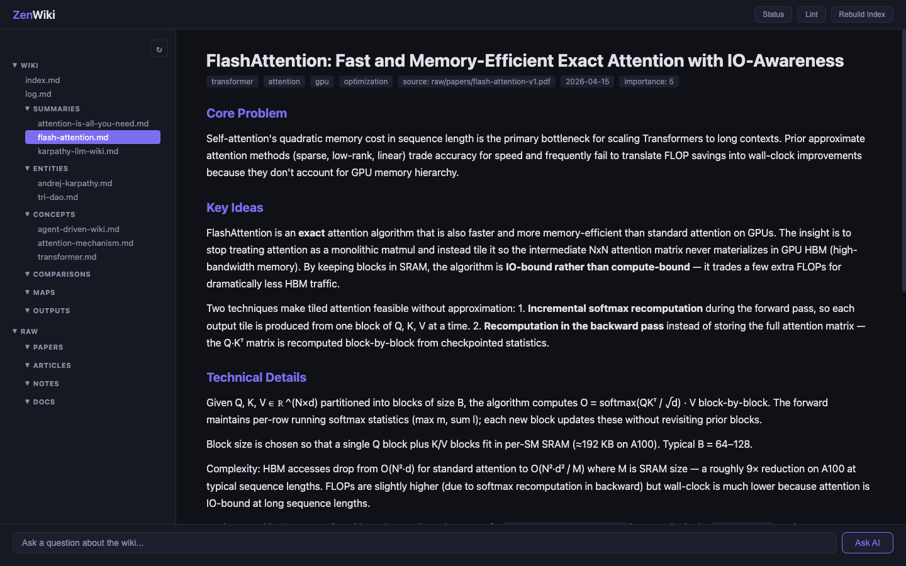
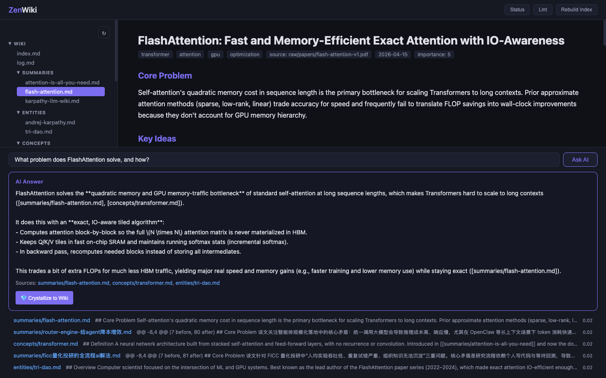
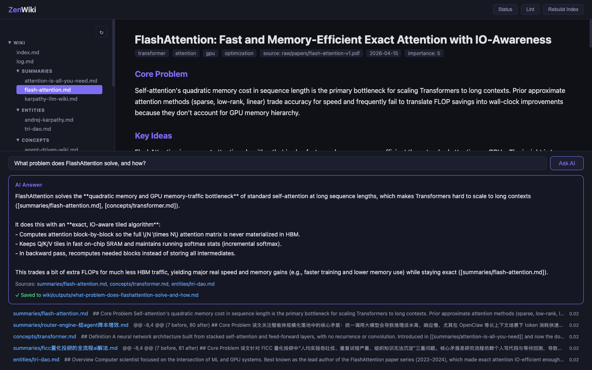

# ZenWiki

[](https://github.com/ChenXplorer/zenwiki/actions/workflows/ci.yml)
[](./LICENSE)
[](https://www.python.org/downloads/)


Agent-driven enterprise knowledge wiki toolkit. Drop files into `raw/`, let an AI agent compile them into a structured, interlinked wiki.

ZenWiki does not call any LLM API. It provides deterministic tools (search, dedup, lint, index) that an external Agent (Claude Code or Codex CLI) uses to build and maintain the wiki.

## Screenshots

|  |  |
|---|---|
| **Browse** — sidebar tree, rendered markdown, frontmatter tags |  |
| **Ask AI** — hybrid retrieval + Agent synthesizes with citations |  |
| **Crystallize** — one-click save Q&A back into `wiki/outputs/` |  |

## How It Works

```
raw/ (your source files)
  │
  ▼
zenwiki serve  ──→  Agent CLI (claude / codex)
                      │
                      ├─ reads CLAUDE.md (schema + workflows)
                      ├─ reads source files from raw/
                      ├─ calls zenwiki tools (find-similar, rebuild-index, ...)
                      └─ writes structured pages to wiki/
                            │
                            ▼
                      wiki/ (browsable in Web UI, Obsidian, or Git)
```

## Install

### Prerequisites

**Required:**
- Python 3.10+
- An Agent CLI: [Claude Code](https://docs.anthropic.com/en/docs/claude-code) **or** [Codex CLI](https://github.com/openai/codex) — and you must be logged in (`claude /login` or `codex login`).

**Optional:**
- [qmd](https://github.com/tobi/qmd) on `$PATH` → Ask AI uses hybrid BM25 + vector search. Without qmd → falls back to BM25 only. Everything still works.
- Git — recommended; `codex` additionally requires the project to live inside a git repo.

### Install ZenWiki

```bash
pip install git+https://github.com/ChenXplorer/zenwiki.git
```

That's it. The Web UI ships inside the wheel, so no `npm install` is needed for end users. (Contributors who modify the frontend: see [CONTRIBUTING.md](./CONTRIBUTING.md).)

## Quickstart

### 1. Create a project

```bash
zenwiki init my-wiki
cd my-wiki
```

This generates the scaffold:

```
my-wiki/
├── CLAUDE.md           # Schema for AI agents
├── config.yaml         # Configuration
├── .zenwiki/           # Internal state (manifest)
├── raw/{papers,articles,notes,docs}/   # You drop source files here
└── wiki/{summaries,entities,concepts,comparisons,maps,outputs}/   # Agent-maintained output
```

**If you plan to use `codex` as the Agent, also initialize git now** (codex refuses to run outside a git repo):

```bash
git init -q && git add -A && git commit -q -m "init"
```

### 2. Verify the environment

```bash
zenwiki doctor
```

You should see green checks for `config.yaml`, `CLAUDE.md`, `raw/`, `wiki/`, and **at least one** of `claude CLI` / `codex CLI`. `qmd` red is fine — Ask AI still works without it.

### 3. Drop source files into `raw/`

```bash
cp ~/your-files/*.pdf raw/papers/
cp ~/your-notes/*.md  raw/notes/
```

**No sources handy?** Grab a public paper to try it end-to-end:

```bash
curl -L -o raw/papers/attention-is-all-you-need.pdf \
  https://arxiv.org/pdf/1706.03762.pdf
```

### 4. Start the server

```bash
zenwiki serve
```

This launches:
- **API + Web UI** on `http://127.0.0.1:3334` — the bundled UI is served by FastAPI
- **Compile watcher** on `raw/` — auto-compiles new/changed files via the Agent CLI

A browser tab opens automatically. If you installed the package from a cloned repo with `npm install` done, a Vite dev server also starts on `:5173` with hot reload — otherwise just use `:3334`.

### 5. Explore

Once the watcher finishes compiling your sources (takes a minute or two per file — the Agent actually reads them):

- Click the 🔄 button in the sidebar to refresh the tree
- Open a summary page to see structured output
- Use the **Ask AI** search bar (Enter) to query the wiki — the Agent retrieves top-5 pages and synthesizes an answer with citations
- Click **💎 Crystallize to Wiki** under any answer to save it as a new page under `wiki/outputs/` so future queries can find it

### Troubleshooting the first run

| Symptom | Cause | Fix |
|---|---|---|
| `zenwiki: command not found` | pip's scripts dir not on PATH | `python -m zenwiki --help`, or add pip's user bin to PATH |
| Compile hangs silently, no files appear in `wiki/summaries/` | Agent CLI not logged in | `claude /login` or `codex login` — ZenWiki shells out to these and inherits their auth |
| Compile errors with `Not inside a trusted directory` | You're using codex in a non-git directory | `git init -q` inside the project root, or switch to `claude` (no such requirement) |
| Browser tab opens but Ask AI returns nothing | Agent CLI failed silently | Check `.zenwiki/compile-runs.jsonl` (per-call audit), or run `zenwiki doctor` |
| `qmd` shown red in doctor | Not installed | Ignore — Ask AI falls back to BM25 and still works |

### 5. Manual compile (optional)

`serve` already auto-compiles on file changes. These commands are for manual control:

```bash
# See what needs processing
zenwiki pending

# Compile all pending files now
zenwiki compile

# Preview without compiling
zenwiki compile --dry-run

# Handle deleted source files
zenwiki compile --prune

# Watch mode: auto-compile on file changes (blocking)
zenwiki compile --watch
```

Compilation is **incremental** — only new or modified files are processed. File changes are detected via mtime + SHA-256 hash, so scanning thousands of files is instant.

Compilation runs **serially by default** (1 worker, 2 files per batch). Concurrency is configurable in `config.yaml`, but raising it above 1 risks lost writes on shared files (`wiki/index.md`, `wiki/log.md`, same-name concept pages) — only do so if you accept that risk or your batches don't overlap.

Each compiled summary is also passed through a **lint gate** before being marked successful — see [Quality gates](#quality-gates).

### 6. Search and explore

```bash
# Search wiki content (BM25 by default; hybrid BM25 + vectors if qmd is installed)
zenwiki search "flash attention memory optimization"

# Trace a source file to its wiki pages
zenwiki provenance raw/papers/flash-attention.pdf

# Check wiki health
zenwiki lint
```

## Manual Agent Usage

Instead of auto-compile, you can work interactively with an Agent:

```bash
cd my-wiki

# Claude Code
claude
# > "ingest raw/papers/flash-attention.pdf"

# Codex CLI
codex
# > "ingest raw/papers/flash-attention.pdf"
```

The Agent reads `CLAUDE.md` for rules and calls `zenwiki` tools as needed.

## Commands

| Command | Description |
|---------|-------------|
| `zenwiki init [path]` | Create a new project |
| `zenwiki doctor` | Check environment readiness |
| `zenwiki serve [--port] [--no-watch] [--no-ui] [--no-open]` | Start API + Web UI + compile watcher |
| `zenwiki status` | Show wiki statistics |
| `zenwiki pending` | Show unprocessed files in raw/ |
| `zenwiki compile [--watch] [--dry-run] [--prune]` | Manual compile (serve already auto-compiles) |
| `zenwiki search "<query>"` | Search wiki (requires qmd) |
| `zenwiki find-similar "<name>"` | Check for duplicate pages |
| `zenwiki provenance <path>` | Show source-to-article provenance |
| `zenwiki slug "<title>"` | Generate kebab-case slug |
| `zenwiki rebuild-index` | Regenerate wiki/index.md |
| `zenwiki refresh` | Refresh search index |
| `zenwiki log "<message>"` | Append to wiki/log.md |
| `zenwiki lint [--fix]` | Run wiki health checks |
| `zenwiki deprecate <path> "<reason>"` | Soft-delete a page (sets `deprecated: true`); excluded from Ask AI, lint flags inbound links |
| `zenwiki retract <path>` | Hard-delete a page; logged in `log.md` |

## Configuration

`config.yaml`:

```yaml
serve:
  port: 3333
  bind: "127.0.0.1"
compile:
  agent: "auto"                   # auto / claude / codex
  debounce_seconds: 30            # watch mode debounce
  auto_commit: true               # git commit after compile
  batch_size: 2                   # files per Agent process
  concurrency: 1                  # parallel Agent processes (>1 risks racing on wiki/index.md, log.md)
  consolidate_threshold: 1        # run /consolidate after every batch with N+ compiled files (0 = never auto-consolidate)
  prune_grace_hours: 24           # wait this long after a raw file disappears before --prune touches the wiki page
  preflight_cache_seconds: 600    # reuse a successful preflight result for 10 min (saves an LLM call per debounce)
```

A `.gitignore` is also generated by `zenwiki init` to keep local caches (`search.db`, `preflight.json`, `dedup-audit.jsonl`) out of git while tracking `manifest.json`.

## Wiki Structure

The Agent creates 6 types of wiki pages:

| Type | Directory | Purpose |
|------|-----------|---------|
| Summaries | `wiki/summaries/` | Deep-dive of each source file |
| Entities | `wiki/entities/` | People, companies, products, tools |
| Concepts | `wiki/concepts/` | Theories, methods, technologies |
| Comparisons | `wiki/comparisons/` | Cross-source analysis |
| Maps | `wiki/maps/` | Topic navigation, domain overviews |
| Outputs | `wiki/outputs/` | Query write-back, generated analysis |

All pages use YAML frontmatter and `[[wikilinks]]`, compatible with Obsidian.

## Search & Retrieval

ZenWiki has two retrieval paths:

### Path 1: Agent queries (Karpathy pattern)

When an LLM Agent answers questions or compiles sources, it follows the original [Karpathy LLM Wiki](https://gist.github.com/karpathy/442a6bf555914893e9891c11519de94f) pattern:

```
Agent reads index.md (catalog)
  → identifies relevant pages
  → reads wiki/ pages (compiled summaries)
  → if more detail needed, follows source_path back to raw/
```

No search engine required. The Agent itself is the retriever. This works well at moderate scale (~100 sources, hundreds of wiki pages) because `index.md` fits in the context window.

### Path 2: Web UI Ask AI

The search bar in the Web UI is a single **Ask AI** flow:

```
User question
  → SQLite FTS5 (BM25) + qmd vsearch (if qmd is installed), merged via RRF
  → top-10 wiki pages fetched (deprecated pages filtered out)
  → Agent CLI synthesizes an answer via subprocess (codex exec | claude -p --bare)
  → returned with source citations
```

There is no separate keyword-search button: every query goes through Ask AI. A plain `zenwiki search "<q>"` CLI remains available for scripting.

**Retrieval biases tuned for the Karpathy pattern:**
- Semantic frontmatter fields (`tags`, `key_concepts`, `key_entities`, `subjects`, `key_sources`, `related_concepts`, `category`) are folded into the FTS title column (BM25 weight 5.0). This fixes the common case where a map page has an English title but Chinese tags (or vice versa) — its declared coverage becomes searchable.
- `maps/` and `comparisons/` pages get a **hard slot** in hybrid search results: if at least one matches the query but neither made the RRF top-10, the best match of each prefix is swapped in. This corrects for the structural BM25 disadvantage of directory-style pages (short body, long frontmatter lists) and ensures cross-cutting questions reach the pages designed to answer them. Specific-entity queries don't match these prefixes → no promotion → ordering unchanged.

### qmd is optional

If [qmd](https://github.com/tobi/qmd) is on `$PATH`, ZenWiki uses it for the vector leg of hybrid retrieval. If it isn't, ZenWiki silently falls back to BM25 only — everything still works, results are just keyword-only. There is no config knob for this; it is auto-detected.

qmd stores indexes under `~/.cache/qmd/`. If you run multiple ZenWiki projects on the same machine they currently share a `wiki` collection — good enough for single-user single-project use, not for running several projects side by side.

## Crystallizing Ask AI answers

The "💎 Crystallize to Wiki" button under each Ask AI answer writes the Q&A as `wiki/outputs/{slug}.md` with this frontmatter:

```yaml
---
title: "<the question>"
date_added: YYYY-MM-DD
citations: [...]              # the source pages used to synthesize the answer
crystallized_from_query: true # marker for future filtering / review tooling
---
```

After writing, ZenWiki refreshes the search index, rebuilds `index.md`, and appends to `log.md`. The page is **immediately** searchable and immediately retrievable by the next Ask AI query.

There is intentionally **no draft / review state** in the MVP — clicking save is a single act. If a wrong answer gets in, retract or deprecate it (next section). The `crystallized_from_query` field is left in place as a hook in case you ever want to add a review pipeline (e.g. exclude unreviewed crystallizations from Ask AI context).

## Page lifecycle: deprecate / retract

Wiki pages can be soft-removed without deleting them:

```bash
# Soft-remove (preferred when other pages link to it)
zenwiki deprecate wiki/outputs/wrong-answer.md "Cited a hallucinated number"

# Hard-remove (use when no other pages reference it)
zenwiki retract wiki/outputs/wrong-answer.md
```

`deprecate` adds `deprecated: true` + `deprecated_reason` + `deprecated_at` to the frontmatter. The page stays in the file tree so inbound `[[wikilinks]]` don't break, but:

- **Ask AI** filters deprecated pages out of its context — wrong content can't pollute future answers
- **Lint** flags every page that still links to deprecated content (`link_to_deprecated` rule), prompting cleanup

`retract` deletes the file outright, rebuilds the index, and logs the removal.

## Quality gates

Compilation isn't done when the Agent finishes — every batch goes through deterministic lint rules, and a subset will **demote a "compiled" file back to "failed"** so the watcher retries it. The full rule set:

| Rule | What it checks | Blocks compile? |
|------|----------------|-----------------|
| `broken_link` | wikilink to non-existent page | warn |
| `missing_frontmatter` | missing `title` field | block |
| `orphan` | page with no inbound wikilinks | warn |
| `heading_structure` | heading levels skip (`#` → `###`) | warn |
| `empty_section` | heading with no content under it | block |
| `thin_summary` | `## Technical Details` shorter than 200 non-whitespace chars | block |
| `missing_backlink` | A links to B but B's `key_sources` / `related_concepts` doesn't list A | block |
| `unverified_dedup` | new concept/entity created without a matching `find-similar` audit entry | warn |
| `link_to_deprecated` | wikilink to a `deprecated: true` page | block |

The dedup audit log lives at `.zenwiki/dedup-audit.jsonl` — every `zenwiki find-similar` call is recorded with timestamp, query, and top score. The `unverified_dedup` rule only flags pages created **after** the audit log started, so existing wiki content isn't retroactively marked.

Run lint manually any time:

```bash
zenwiki lint            # report all issues
zenwiki lint --fix      # auto-fix what can be auto-fixed (currently: missing title)
```

## Design Principles

1. **Agent does all intelligent work** -- reading sources, writing wiki pages, answering questions. ZenWiki calls no LLM API.
2. **ZenWiki does what agents can't** -- local search, deterministic dedup, structural lint, file system watching, lifecycle (deprecate / retract).
3. **File system is truth** -- no database. Markdown files + `index.md` is the entire state. Git is version control. Local caches (search.db, preflight, audit log) live under `.zenwiki/` and are gitignored; `.zenwiki/manifest.json` is the only tracked file in there.
4. **Incremental by default** -- mtime + SHA-256 change detection, only recompile what changed. Source removals get a 24h grace period so transient absences (git checkout, file moves) don't trigger prune.
5. **Serial by default, parallel by config** -- batch size and concurrency are tunable, but the default (1 worker) avoids races on shared files. Bump only after reviewing the trade-offs.
6. **Quality is gated, not assumed** -- nine deterministic lint rules; four of them block a "compiled" file from being marked successful, forcing the Agent to retry. See [Quality gates](#quality-gates).

## Architecture

```
┌──────────────────────────────────────────────────────────────┐
│  zenwiki serve                                               │
│                                                              │
│  ┌──────────┐  ┌──────────────────┐  ┌────────────────────┐  │
│  │ API      │  │ Compile Watcher  │  │ Vite Dev Server    │  │
│  │ (FastAPI)│  │ raw/ → Agent CLI │  │ (React frontend)   │  │
│  │ :3334    │  │  → lint gate     │  │ :5173              │  │
│  └──────────┘  └──────────────────┘  └────────────────────┘  │
│       ▲                 │                    │ proxy /tree   │
│       │                 ▼                    │ proxy /doc    │
│       │           Agent CLI                  │ proxy /search │
│       │           (1 worker default;         │ proxy /query  │
│       │            cached preflight)         │ proxy /status │
│       │                                      │ /crystallize  │
│       └──────────────────────────────────────┘               │
└──────────────────────────────────────────────────────────────┘
```

## References

- [Karpathy LLM Wiki](https://gist.github.com/karpathy/442a6bf555914893e9891c11519de94f) -- the original idea
- [OmegaWiki](https://github.com/skyllwt/OmegaWiki) -- academic implementation
- [sage-wiki](https://github.com/xoai/sage-wiki) -- self-contained Go implementation
- [qmd](https://github.com/tobi/qmd) -- local Markdown search engine

## License

MIT
