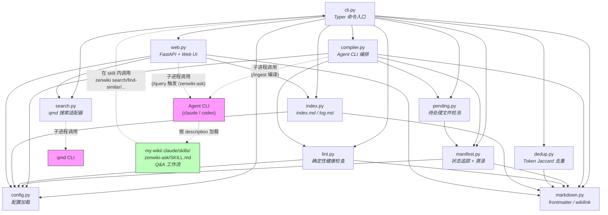
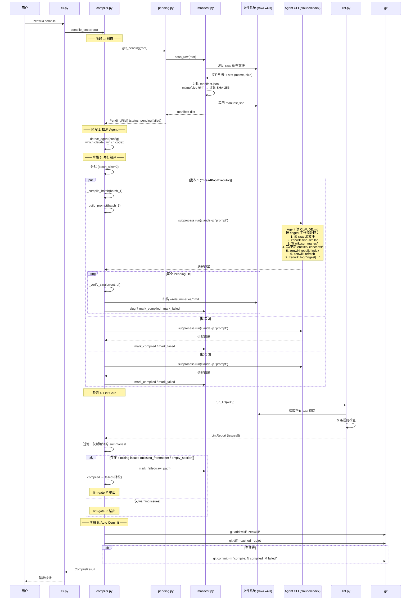
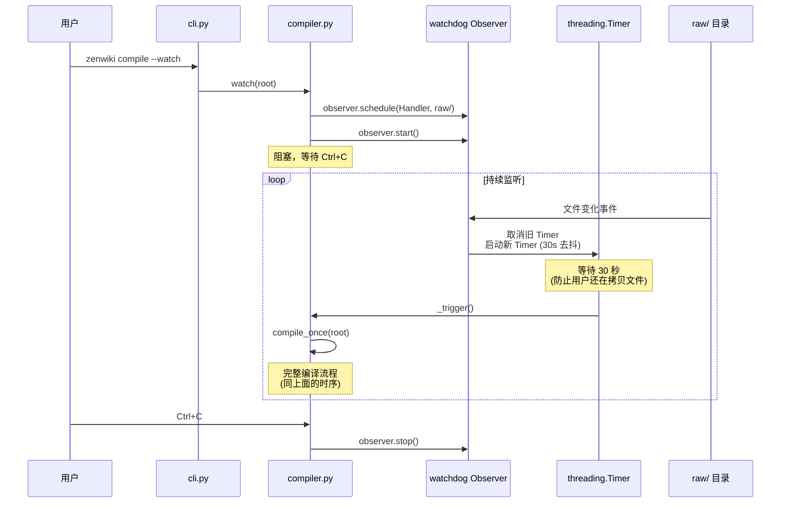
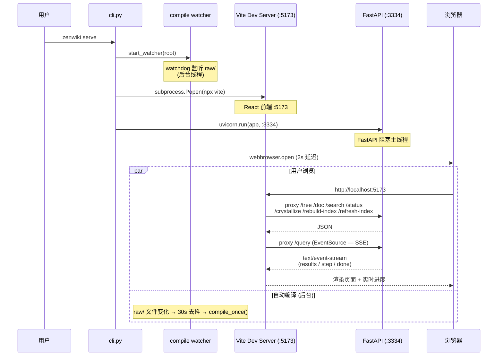
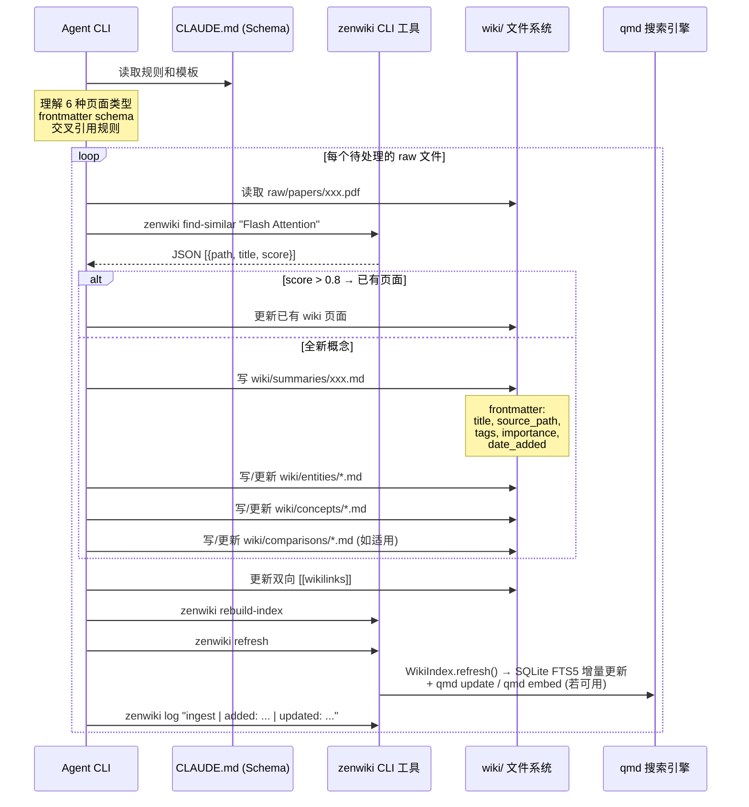
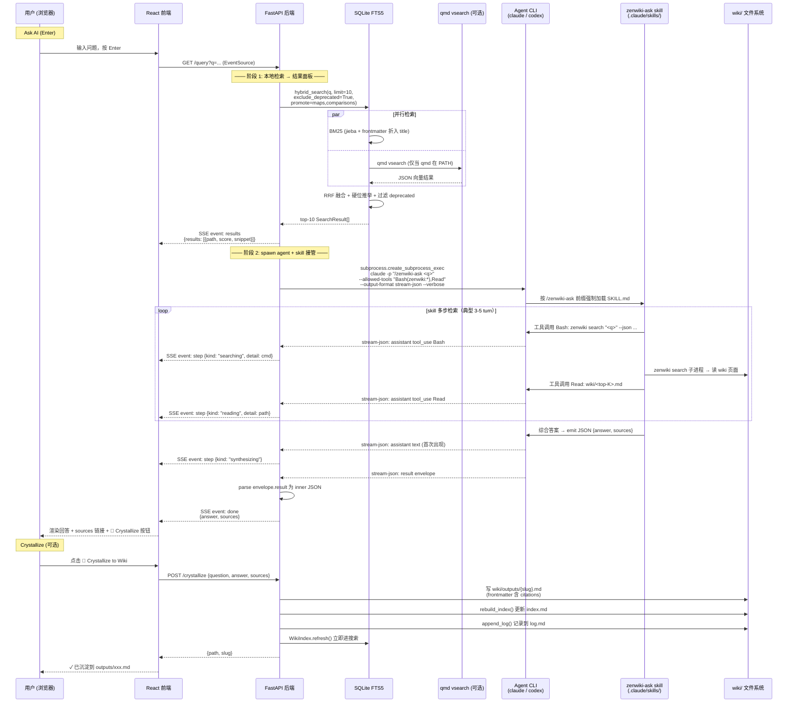
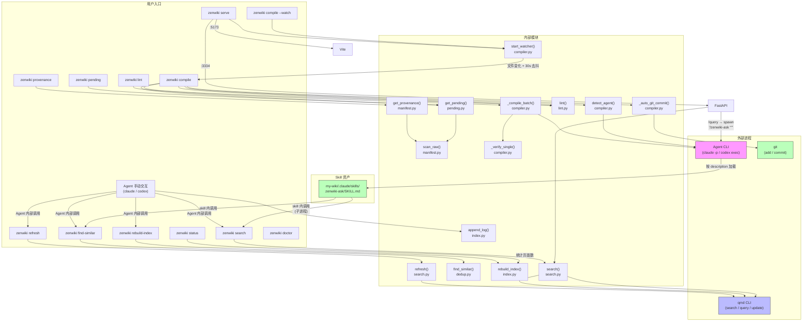
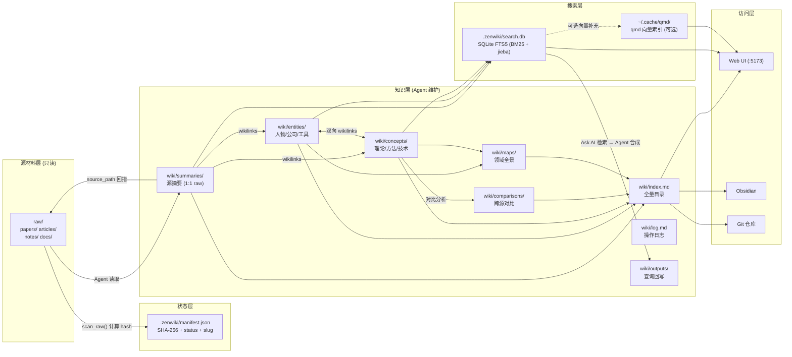
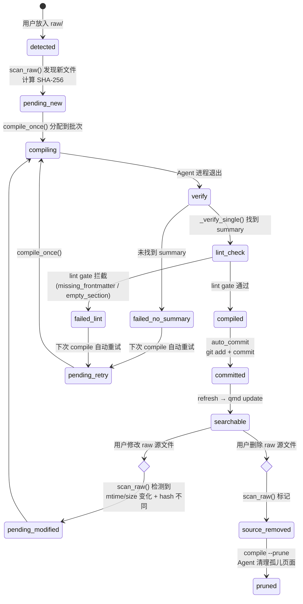
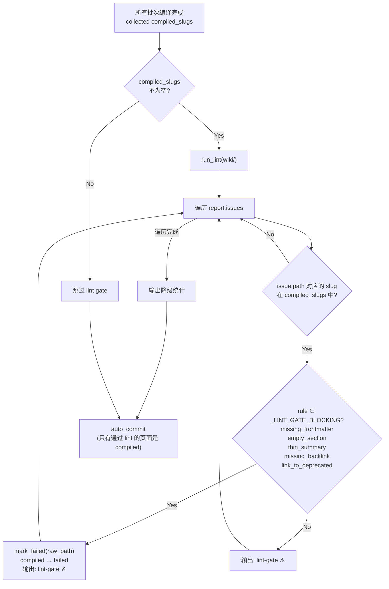

# ZenWiki 系统时序图 & 触发图

## 1. 模块依赖图（静态结构）

---

## 2. 自动编译完整时序图（`zenwiki compile`）

这是系统的核心链路，从用户放入文件到 git commit 的完整时序。

---

## 3. Watch 模式时序图（`zenwiki compile --watch`）

---

## 4. Serve 模式时序图（`zenwiki serve`）

---

## 5. Agent /ingest 工作流时序图

这是 Agent 内部的工作流 — Agent 读 CLAUDE.md 后按照规则执行。

---

## 6. Web UI 查询时序图（Ask AI + Crystallize）

Web UI 搜索栏只有一种交互：**Ask AI**。按 Enter 后 FastAPI 不再"自己拼 prompt"，而是把任务整体外包给 `zenwiki-ask` skill —— spawn `claude -p "/zenwiki-ask <q>"`，把 stream-json 事件翻译成 SSE 推给浏览器。`/zenwiki-ask` 前缀是必需的（stage-0 验证：description 自动匹配在 `-p` 模式不可靠）。合成返回后可选 Crystallize 把问答沉淀回 wiki。

**几个关键点**：

- **本地检索结果会跑两次**：FastAPI 阶段 1 跑一次给 UI 透明面板用，skill 内部又跑一次给 LLM 综合用。前者廉价（SQLite + 可选 qmd），换来 UI 不耦合 skill 输出 schema。
- **Codex 路径退化**：`_detect_query_agent` 选到 codex 时不走 stream-json（schema 未实测），改成 `subprocess.run` + 一次性 `done` 事件，无中途 step 进度。
- **qmd 不在 PATH 时静默降级**为纯 BM25；整条链路依旧可用，只是检索精度下降。
- **`--allowed-tools` 是变长 flag**：必须放在 prompt 之后，否则会贪婪吞掉 prompt 参数 —— 这是 `_Agent.argv()` 把 prompt 夹在 `pre`（`-p`）和 `post`（`--output-format ...` `--allowed-tools ...`）之间的原因。

---

## 7. 系统触发图（谁触发谁）

展示所有入口动作和它们触发的内部调用链。

---

## 8. 数据流向图（信息从哪来，到哪去）

---

## 9. 编译单文件的完整生命周期

一个 raw 文件从进入系统到最终呈现的全部状态变迁。

---

## 10. Lint Gate 决策流程图

